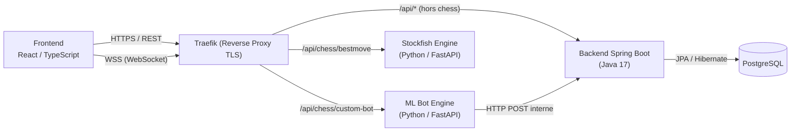

# Rapport Technique — Évolution de l'Écosystème ChessMate

**Projet Tutoré — Semestre 2 (2025-2026)**

---

## Introduction

Le second semestre a été consacré à l'évolution architecturale de la plateforme **ChessMate**, avec pour objectif de transformer une application monolithique en un **écosystème microservices découplé** capable de supporter des interactions temps réel, des calculs d'inférence lourds, et un système social complet. Les axes principaux couvrent l'intégration d'un moteur d'IA sur mesure, la conception d'un système multijoueur avec matchmaking, la refonte de la couche sociale (amis, messagerie), et l'orchestration de l'ensemble via une infrastructure conteneurisée.

---

## 1. Architecture Générale du Système

L'architecture repose sur une séparation stricte des responsabilités entre trois services principaux, communiquant via des protocoles distincts.



### Flux de communication inter-services

| Émetteur | Destinataire | Protocole | Objectif |
|:---|:---|:---|:---|
| Frontend → Backend | Spring Boot | **HTTPS REST** (JWT) | Authentification, CRUD, chat persisté, amis |
| Frontend → AI Engine | FastAPI | **HTTPS REST** | Inférence ML, matchmaking REST |
| Frontend → AI Engine | FastAPI | **WSS (WebSocket)** | Parties temps réel, chat in-game |
| Frontend → Stockfish | FastAPI | **HTTPS REST** | Analyse de positions, meilleur coup |
| AI Engine → Backend | Spring Boot | **HTTP POST interne** | Sauvegarde des résultats de parties (`/api/online-parties/save`) |

> [!IMPORTANT]
> Le client React ne communique **jamais directement** entre les microservices backend. Chaque service expose ses propres endpoints et le routage est assuré par **Traefik** via des règles de priorité basées sur le `PathPrefix`.

---

## 2. Microservice d'Intelligence Artificielle et Optimisation de l'Inférence

### 2.1 Conception du Service

Un microservice dédié a été conçu avec **FastAPI** (Python 3.11) pour héberger le moteur de bot d'échecs. Ce choix technique est motivé par la compatibilité native de Python avec **TensorFlow** et par les capacités asynchrones de FastAPI, essentielles pour gérer simultanément l'inférence et les connexions WebSocket.

**Stack du service :**
- **FastAPI 0.110** — Framework ASGI pour les endpoints REST et WebSocket
- **Pydantic 2.6** — Validation stricte des schémas d'entrée (ex: `CreateGameRequest`, `MatchmakingRequest`)
- **TensorFlow** — Chargement et inférence du modèle `saved_model.pb`
- **python-chess 1.10** — Représentation légale de l'échiquier et validation des coups
- **httpx** — Client HTTP asynchrone pour les appels inter-services vers Spring Boot

### 2.2 Encodage de l'État et Inférence

Le plateau de jeu est encodé sous forme de tenseur **8×8×13** :
- Les 12 premiers canaux représentent les 6 types de pièces × 2 couleurs (présence binaire)
- Le 13e canal encode le trait (1.0 = Blancs, 0.0 = Noirs)

Pour chaque coup légal, le modèle évalue la position résultante. Le bot sélectionne alors le coup maximisant (ou minimisant, selon sa couleur) le score d'évaluation prédit.

### 2.3 Gestion de la Latence d'Inférence (Timeout 30s)

L'optimisation du temps de réponse a constitué un axe technique majeur. Un délai d'attente de **30 secondes** (`AbortSignal.timeout(30000)`) a été configuré côté frontend pour absorber deux phénomènes :

1. **Cold Start** — Le chargement initial du modèle TensorFlow en mémoire (poids, graphe de calcul) impose une latence significative lors du premier appel après démarrage du conteneur Docker.
2. **Complexité computationnelle** — L'évaluation de chaque coup légal nécessite une forward pass à travers le réseau de neurones convolutif (CNN), et le nombre de coups légaux peut atteindre ~35 en milieu de partie.

> [!NOTE]
> **Piste d'amélioration envisagée** — Afin de réduire ce délai en production, l'utilisation de techniques de **quantification de modèle (Quantization)** ou le passage à un format **ONNX Runtime** pour l'inférence est envisagé. Ces optimisations permettraient de réduire la latence d'un facteur 3 à 5 sans dégradation significative de la qualité de jeu, rendant le timeout de 30s inutile.

### 2.4 Analyse via Stockfish (Service Séparé)

En parallèle du bot ML, un second microservice FastAPI encapsule le moteur **Stockfish** pour l'analyse positionnelle. Ce découplage garantit que la charge computationnelle de Stockfish (algorithme Minimax avec élagage Alpha-Beta) n'impacte pas les performances du bot ML ni du système multijoueur.

---

## 3. Système de Matchmaking et Gestion de la Concurrence

### 3.1 Algorithme de Correspondance

L'implémentation du matchmaking repose sur une **file d'attente en mémoire** (liste Python), classée par catégories de cadence. Lorsqu'un joueur soumet une requête de matchmaking, le système :

1. Supprime toute entrée antérieure du même joueur (prévention des doublons)
2. Parcourt la file à la recherche d'un adversaire correspondant (même `timeMinutes` et `increment`)
3. En cas de correspondance : crée un `GameRoom`, assigne les couleurs, et retourne le `gameId` aux deux joueurs
4. En l'absence de correspondance : inscrit le joueur dans la file avec un timestamp

Un mécanisme de **nettoyage périodique** (tâche asynchrone toutes les 60 secondes) purge automatiquement :
- Les entrées de matchmaking inactives depuis plus de **5 minutes**
- Les parties terminées depuis plus de **30 minutes**
- Les salons abandonnés (jamais démarrés) depuis plus de **10 minutes**

> [!NOTE]
> **Limite identifiée** — La file d'attente étant stockée en mémoire volatile, un redémarrage du microservice FastAPI entraîne la perte de toutes les sessions en attente. Dans une perspective d'évolution, l'intégration d'un **cache distribué** (type **Redis**) permettrait de rendre le matchmaking **stateless** et résilient aux redémarrages, tout en supportant un déploiement horizontal (plusieurs instances).

### 3.2 Expérience Utilisateur Côté Frontend

Le frontend implémente un **polling actif** via `checkMatch()` (appels GET réguliers) pour détecter quand un adversaire a été trouvé. L'utilisateur dispose d'une option d'annulation synchrone (`cancelMatchmaking`) qui retire immédiatement son entrée de la file côté serveur.

---

## 4. Couche Sociale : Système d'Amis et Modélisation Relationnelle

### 4.1 Conception de la Table `Friendship`

L'entité `Friendship` a été conçue selon un modèle relationnel bidirectionnel avec gestion d'états :

```
Friendship
├── id (PK, auto-generated)
├── id_joueur_from (FK → Joueur) — Expéditeur de la demande
├── id_joueur_to   (FK → Joueur) — Destinataire
├── status         (ENUM: PENDING, ACCEPTED, DECLINED)
└── createdAt      (TIMESTAMP)
```

**Requêtes JPQL spécifiques :**
- `findBetween(j1, j2)` — Vérifie l'existence d'une relation dans les deux sens (bidirectionnalité), empêchant les doublons de demandes
- `findFriendsOf(joueur)` — Récupère toutes les amitiés `ACCEPTED` où le joueur est expéditeur ou destinataire

### 4.2 Flux de Gestion des Demandes

Le contrôleur `FriendshipController` implémente les règles métier suivantes :
- **Auto-invitation interdite** — Vérification que `target.pseudo ≠ me.pseudo`
- **Unicité garantie** — Contrôle préalable via `findBetween()` avant toute insertion
- **Recherche optimisée** — Endpoint `/api/friends/search` utilisant un filtre `ContainingIgnoreCase` sur les pseudonymes (recherche par sous-chaîne insensible à la casse), limité à 10 résultats

### 4.3 Configuration de la Sécurité et Politique CORS

L'interconnexion entre le frontend (port 5173 en développement) et les microservices a nécessité une configuration fine de la politique de sécurité dans `SecurityConfig.java` :

- **CORS** — Utilisation de `setAllowedOriginPatterns("*")` compatible avec `allowCredentials(true)`, autorisant tous les ports de développement (3000, 5173, 8080)
- **Filtrage JWT** — Résolution d'un problème critique de **double exécution** du filtre JWT : Spring Boot enregistrait automatiquement `JwtFilter` comme filtre Servlet en plus de son insertion dans la chaîne Spring Security. La solution a consisté à désactiver l'auto-enregistrement via `FilterRegistrationBean.setEnabled(false)`
- **Endpoints publics** — Les routes `/api/friends/**` et `/api/chat/**` sont marquées `permitAll()` au niveau Spring Security ; la vérification d'authentification est gérée **manuellement** dans chaque contrôleur via l'objet `Authentication`

### 4.4 Interopérabilité de la Sécurité (JWT inter-services)

> [!IMPORTANT]
> Le service Python (AI Engine) **ne valide pas** les tokens JWT. Seul le backend Spring Boot gère l'authentification. Le microservice Python opère sur un **réseau Docker interne** (`chessmate_internal`) non exposé directement à Internet. Les appels du client vers le service Python (matchmaking, coups) ne contiennent pas de header `Authorization` — la sécurité repose sur l'isolation réseau et les règles Traefik. Lorsque le service Python doit persister un résultat de partie, il effectue un **appel HTTP POST interne** vers Spring Boot (`/api/online-parties/save`) sur le réseau Docker, sans nécessité de JWT.

---

## 5. Communication Temps Réel : Chat et Synchronisation de Parties

### 5.1 Architecture Double Couche de Messagerie

Deux systèmes de messagerie coexistent, chacun répondant à un besoin distinct :

| Canal | Protocole | Persistence | Couverture |
|:---|:---|:---|:---|
| **Chat Social (DMs)** | REST + WebSocket | Oui (via `ChatMessage` en BDD) | Entre amis, hors partie |
| **Chat In-Game** | WebSocket uniquement | Non (mémoire volatile) | Pendant une partie en cours |

**Chat Social :** Les messages sont persistés via JPA (`ChatMessageRepository`) avec des requêtes JPQL spécifiques :
- `findDirectMessages(j1, j2)` — Récupère l'historique bidirectionnel en filtrant les messages `gameId IS NULL`
- `countUnread(joueur)` — Compte les messages non lus (champ `isRead = false`)

**Chat In-Game :** Géré intégralement par le WebSocket de la partie (`/api/chess/ws/game/{gameId}`), les messages sont diffusés aux participants connectés sans persistance en base.

### 5.2 Gestion des Connexions WebSocket

Le frontend implémente un **pattern d'identification** au premier message :
1. Connexion au WebSocket (`connectGameWebSocket(gameId)`)
2. Envoi immédiat d'un JSON `{ "username": "..." }` pour identifier le joueur
3. Réception de l'état initial du jeu (FEN, horloges, coups légaux)
4. Écoute continue des événements : `move`, `game_start`, `game_over`, `draw_offer`, `chat`

Un **mécanisme d'affichage optimiste** (optimistic UI update) est utilisé pour le chat : le message de l'expéditeur s'affiche immédiatement dans son interface sans attendre la confirmation serveur.

---

## 6. Salons de Jeu Privés et Défis entre Amis

### 6.1 Création de Partie par Code

Le système de salons privés repose sur la génération d'identifiants **UUID v4 tronqués** (8 caractères hexadécimaux, via `uuid.uuid4().hex[:8]`). Le flux est le suivant :

1. **Création** — Le joueur appelle `POST /multiplayer/create`, un `GameRoom` est instancié avec le créateur en tant que Blancs
2. **Attente** — Le frontend affiche l'écran "En attente d'un adversaire" avec le code de la partie. L'échiquier est **verrouillé** (aucune interaction possible) tant que le second joueur n'a pas rejoint
3. **Jonction** — L'ami entre le code et appelle `POST /multiplayer/join/{gameId}`. Le serveur assigne le rejoint en tant que Noirs et déclenche l'événement `game_start` via WebSocket aux deux clients

### 6.2 Défi Direct depuis la Page Amis

Un mécanisme de **challenge** via WebSocket permet d'envoyer un défi directement depuis la page des amis :
- L'expéditeur crée une partie et envoie un message WebSocket de type `challenge` contenant le `gameId`
- Le destinataire reçoit la notification et peut accepter (`challenge_response` avec `accepted: true`) ou refuser
- Si le destinataire est hors ligne, un message `challenge_offline` est renvoyé à l'expéditeur

---

## 7. Persistance des Parties en Ligne

### 7.1 Entité `OnlinePartie` — Conception Séparée

Une entité distincte `OnlinePartie` a été conçue, **séparée intentionnellement** de l'entité `Partie` existante. Cette décision architecturale s'explique par le fait que l'entité `Partie` possède des clés étrangères complexes (vers `Ouverture`, `Cadence`, `Tournoi`) qui ne s'appliquent pas aux parties en ligne occasionnelles.

```
OnlinePartie
├── id (PK)
├── gameId (UNIQUE) — UUID du salon WebSocket
├── id_joueur_blanc (FK → Joueur)
├── id_joueur_noir  (FK → Joueur)
├── resultat (1 = Blancs, 0 = Nul, -1 = Noirs)
├── resultType ("checkmate", "timeout", "resign", "draw", "disconnect")
├── pgn (TEXT) — Notation PGN reconstruite
├── timeControl (ex: "5+3")
├── playedAt (TIMESTAMP)
└── totalMoves (INT)
```

### 7.2 Sauvegarde Automatique Post-Partie

À la fin de chaque partie (mat, timeout, abandon, déconnexion), le microservice Python reconstruit automatiquement la notation PGN à partir de l'historique UCI, puis effectue un `POST /api/online-parties/save` vers le backend Spring Boot pour persister le résultat en base PostgreSQL.

---

## 8. Stack Technologique — Synthèse

| Couche | Technologie | Version | Rôle |
|:---|:---|:---|:---|
| **Frontend** | React / TypeScript / Vite | React 18, Vite 6.3 | Interface SPA, gestion d'état, WebSocket client |
| **Design System** | Radix UI / Lucide Icons | — | Composants accessibles, iconographie cohérente |
| **Backend** | Spring Boot / JPA / Hibernate | Spring 3.5, Java 17 | CRUD, sécurité JWT, persistance relationnelle |
| **Sécurité** | Spring Security / JJWT | JJWT 0.11.5 | Authentification stateless, hachage BCrypt |
| **AI Engine** | FastAPI / TensorFlow / Pydantic | FastAPI 0.110, TF latest | Inférence CNN, matchmaking, WebSockets temps réel |
| **Analyse** | Stockfish (via wrapper Python) | — | Recherche Minimax / Alpha-Beta |
| **Base de données** | PostgreSQL | — | Stockage relationnel (joueurs, parties, amis, chat) |
| **Reverse Proxy** | Traefik | v3 | Routage TLS, règles PathPrefix, headers de sécurité |
| **Conteneurisation** | Docker / Docker Compose | — | Isolation, reproductibilité, orchestration multi-services |
| **Monitoring** | Telegraf / Grafana | Grafana 12.0 | Métriques système, dashboards temps réel |
| **CI/CD** | GitLab CI / Writerside | — | Build automatique, documentation technique |
| **Documentation API** | SpringDoc OpenAPI | 2.6.0 | Génération Swagger automatique |

---

## 9. Compétences Techniques Acquises

1. **Architecture Distribuée** — Maîtrise du découplage des responsabilités entre services hétérogènes (Java, Python) communicant via REST et WebSocket, avec isolation réseau Docker
2. **Déploiement de Modèles ML en Production** — Gestion des contraintes de latence d'inférence (Cold Start, complexité computationnelle), identification des pistes d'optimisation (quantification, ONNX)
3. **Sécurité Applicative** — Configuration fine des politiques CORS et des chaînes de filtres Spring Security, résolution de problèmes de double enregistrement de filtres
4. **Communication Temps Réel** — Implémentation de protocoles WebSocket bidirectionnels avec gestion des états de connexion, reconnexion et affichage optimiste
5. **Modélisation Relationnelle** — Conception d'entités JPA avec requêtes JPQL bidirectionnelles complexes, séparation intentionnelle des modèles de données selon les cas d'usage
6. **DevOps et Orchestration** — Utilisation avancée de Docker Compose avec réseaux isolés, configuration de Traefik comme point d'entrée unique avec routage par PathPrefix et priorités
